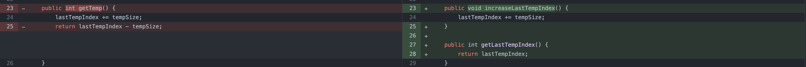

# SWE Lab 7

Ahmad Salimi - 97106013

## Report

### Facade

Facade refactoring is a technique used to simplify the interface of a complex system by providing a single, unified entry point to the system. The idea behind Facade refactoring is to reduce the number of classes and methods that a client code must interact with, making the system easier to use and understand. The Facade class acts as an intermediary between the client code and the underlying system, hiding the complexities of the system behind a simple and well-defined interface.

#### `CodeGenerator` class

[Commit](https://github.com/ahmadsalimi/SWELab7/commit/c7a1217c5f951dccd35b23c1035934fb8822a52a)

Implementation:

Usages:

#### `Memory` class

[Commit](https://github.com/ahmadsalimi/SWELab7/commit/9e1be70e8937d53c8321a6ac69c76d145ec60e9a)

Implementation:

Instantiation:

Usages:

### Separate query from modifier

"Separate query from modifier" is a refactoring technique used to improve the readability and maintainability of code by separating the code that retrieves data (queries) from the code that modifies data (modifiers). The technique involves creating separate methods for the retrieval of data and the modification of data, so that each method performs only one type of operation. This makes the code easier to understand, test, and maintain, as the queries and modifiers can be developed and tested independently, without affecting each other.

[Commit](https://github.com/ahmadsalimi/SWELab7/commit/73ff9169d73c879e04467b6d872bdd0953c6842e)

Separation of queries and modifiers:

Usage example:

### Loose coupling

"Loose coupling" is a refactoring technique used to improve the maintainability and scalability of software by reducing the dependencies between components. The goal of loose coupling is to create components that can work independently, with minimal knowledge of each other, so that changes to one component do not affect other components. This makes the code easier to maintain and extend over time, as each component can be developed and tested independently, without affecting other components. By reducing the dependencies between components, loose coupling also improves the modularity and reusability of code.

[Commit](https://github.com/ahmadsalimi/SWELab7/commit/898de7fda9dd5d7991488c0741494beab6496881)

Examples:

### Self Encapsulated Field

"Self Encapsulated Field" is a refactoring technique used to improve the maintainability and readability of code by encapsulating fields within objects and providing getter and setter methods for accessing those fields. The idea behind self-encapsulated fields is to hide the internal representation of data within objects, making it easier to change the underlying data structure without affecting other parts of the code. By encapsulating fields within objects, self-encapsulated fields provide a cleaner and more maintainable code structure, as well as a more secure and reliable code, as the internal representation of data can be protected by access control mechanisms.

[Commit](https://github.com/ahmadsalimi/SWELab7/commit/54a3b4db2a33d13b37e4132ee4f67ce09c4b4690)

Encapsulation of fields:

Usage example:

## Remove Switch Statements

"Remove Switch Statements" is a refactoring technique used to improve the maintainability and readability of code by removing complex switch statements and replacing them with alternative code structures. The goal of removing switch statements is to make the code easier to understand, test, and maintain, as switch statements can become complex and difficult to manage as the number of cases increases. By removing switch statements and replacing them with alternative code structures, such as polymorphism or strategy patterns, the code can be made more modular, scalable, and flexible, while reducing the risk of bugs and making it easier to add new functionality.

[Commit](https://github.com/ahmadsalimi/SWELab7/commit/05e13394dd1a988c1438d27c7156d3e8ece09754)

Examples:

## Answers to the questions

1. Definitions:

    1. Clean code: Clean code is code that is well-structured, maintainable, and easy to understand, following best practices in software development.

    1. Technical debt: Technical debt refers to the amount of effort required to maintain or improve a piece of software due to poor design, coding practices, or shortcuts taken during development.

    1. Bad smell: Bad smells refer to patterns in code that indicate potential problems, such as poorly structured code, duplicated code, or inefficient algorithms, that make the code more difficult to maintain and debug.

1. refactoring.guru categories of bad smells:

    1. Bloaters: This class of bad smells refers to parts of the code that have become too large and complex, making it difficult to understand and maintain. Examples include long methods, large classes, and complex control structures.

    1. Object-Orientation Abusers: This class of bad smells refers to code that misuses or violates the principles of object-oriented programming, such as inheritance or polymorphism. Examples include switch statements, global data, and long parameter lists.

    1. Change Preventers: This class of bad smells refers to code that makes it difficult or impossible to modify or extend. Examples include hard-coded dependencies, tight coupling, and data clumps.

    1. Dispensables: This class of bad smells refers to code that is redundant, unused, or outdated, adding no value to the codebase. Examples include dead code, duplicate code, and commented-out code.

    1. Couplers: This class of bad smells refers to code that has a high degree of coupling between components, making it difficult to understand and maintain. Examples include feature envy, shotgun surgery, and middle-man.

1. Lazy class:

    1. Dispensables

    1. The best refactoring technique to resolve a "lazy class" bad smell is "Collapse Hierarchy." This involves removing the lazy class and combining its behavior into another class that is more meaningful and useful. By doing this, you can simplify the codebase and make it easier to understand and maintain. This technique is especially useful when a lazy class is inheriting from another class and adding no new behavior or data fields. In such a case, the lazy class can be safely removed and its behavior can be incorporated directly into the base class.

    1. A "lazy class" can be ignored when it has a well-defined and meaningful role in the codebase. For example, if a lazy class serves as a placeholder for a future implementation, or if it provides a meaningful abstraction for a group of similar classes, it can be acceptable to keep it in the code. However, if the lazy class is not providing any real value, it is best to address it by refactoring it into a more meaningful and useful construct. The goal should always be to keep the codebase simple, easy to understand, and maintainable.
